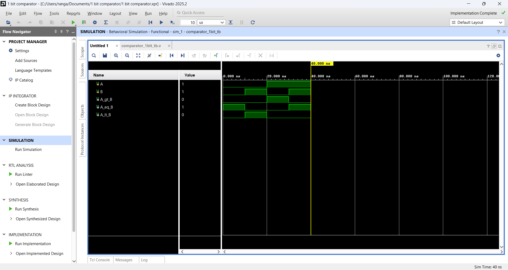

# 1-Bit Comparator using Verilog

## 📌 Project Overview

This project implements a **1-bit Comparator** using Verilog HDL. The comparator compares two 1-bit binary inputs, **A** and **B**, and determines whether:

* A is greater than B
* A is equal to B
* A is less than B

The design was developed and simulated using **Xilinx Vivado**.

---

## 🎯 Objectives

* To design a 1-bit digital comparator using Verilog HDL.
* To understand the working principle of a comparator.
* To write a Verilog design module and testbench.
* To simulate the design using Vivado.
* To verify the outputs using the simulation waveform.

---

## ⚙️ Inputs and Outputs

### Inputs

| Input | Description               |
| ----- | ------------------------- |
| `A`   | First 1-bit binary input  |
| `B`   | Second 1-bit binary input |

### Outputs

| Output        | Description     |
| ------------- | --------------- |
| `A_greater_B` | HIGH when A > B |
| `A_equal_B`   | HIGH when A = B |
| `A_less_B`    | HIGH when A < B |

---

## 📊 Truth Table

| A | B | A > B | A = B | A < B |
| - | - | ----- | ----- | ----- |
| 0 | 0 | 0     | 1     | 0     |
| 0 | 1 | 0     | 0     | 1     |
| 1 | 0 | 1     | 0     | 0     |
| 1 | 1 | 0     | 1     | 0     |

---

## 💻 Verilog Design Code

```verilog
module comparator_1bit (
    input  A,
    input  B,
    output A_greater_B,
    output A_equal_B,
    output A_less_B
);

assign A_greater_B = A & ~B;
assign A_equal_B   = ~(A ^ B);
assign A_less_B    = ~A & B;

endmodule
```

---

## 🧪 Verilog Testbench

```verilog
module comparator_1bit_tb;

reg A;
reg B;

wire A_greater_B;
wire A_equal_B;
wire A_less_B;

comparator_1bit uut (
    .A(A),
    .B(B),
    .A_greater_B(A_greater_B),
    .A_equal_B(A_equal_B),
    .A_less_B(A_less_B)
);

initial begin

    A = 0; B = 0;
    #10;

    A = 0; B = 1;
    #10;

    A = 1; B = 0;
    #10;

    A = 1; B = 1;
    #10;

    $finish;

end

endmodule
```

---

## 📈 Simulation Waveform

The following waveform shows the simulation results for all possible combinations of the two 1-bit inputs.



The waveform verifies that the outputs correctly indicate whether **A > B**, **A = B**, or **A < B**.

---

## 🛠️ Tools Used

* **Verilog HDL**
* **Xilinx Vivado**
* **Vivado Simulator**
* **GitHub**

---

## 🔄 Working Principle

The comparator uses basic logic operations to compare the two inputs.

* `A_greater_B = A & ~B`
* `A_equal_B = ~(A ^ B)`
* `A_less_B = ~A & B`

For every possible combination of `A` and `B`, exactly one of the three comparison outputs becomes HIGH.

---

## ✅ Results

The 1-bit comparator was successfully designed and simulated using Verilog HDL. The simulation waveform confirms that the outputs match the expected truth table for all possible input combinations.

---

## 📁 Project Structure

```text
1-bit-comparator/
│
├── comparator_1bit.v
├── comparator_1bit_tb.v
├── waveform.png
└── README.md
```

---

## 📌 Conclusion

A 1-bit comparator was successfully implemented using Verilog HDL. The design was simulated in Xilinx Vivado, and the obtained waveform verified the correct comparison of the two input bits.

---

## 👩‍💻 Author

**Rangala Aisu**

Electronics and Communication Engineering
NIST University
